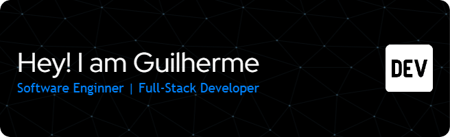

---

  

---

## 👨🏾‍💻 Sobre mim

Sou Guilherme Barbosa, desenvolvedor *Full-Stack* apaixonado por tecnologia. 

- 🎓 Certificado em *Programação Full-Stack pelo SENAI* (2023)
- 🎓 Formado em Técnico em *Agroindústria pelo IFPI*
- 👨‍🎓 Cursando *Engenharia de Software - Unicesumar*
- 💡 Especializando em *C# e .NET (Rocketseat)*
- 📊 Formação complementar em *Assistência Administrativa e Financeira (SENAR)*

Atuo com foco em desenvolvimento web moderno, interfaces intuitivas e soluções conectadas com o negócio.

---

## 🚀 Projetos em Destaque

### 🌐 [ESM Consultoria e Treinamento](https://consultoriaesm.com.br/)
Site institucional para empresa da área de Segurança do Trabalho.  
*Tech Stack:* Angular · TypeScript · Bootstrap · CSSAnimation.io · Canva

---

### ✈ [Viva Mundo](https://vivamundo.vercel.app/)
Plataforma moderna para agências de viagem com UI intuitiva e responsiva.  
*Tech Stack:* Angular · Bootstrap · TypeScript  
🔗 [Documentação](https://github.com/devguilherme-b/viva-mundo) | 🔗 [Acesse o site](https://vivamundo.vercel.app/)

---

## 🧰 Skills & Tecnologias

| Back-End | Front-End | Ferramentas | Banco de Dados |
|----------|-----------|-------------|----------------|
|  |  |  |  |
|  |  |  |  |
|  |  |  |  |
|  |  |  |  |

---

## 📊 Estatísticas GitHub

  

  
  

  

---

## 📫 Entre em contato

